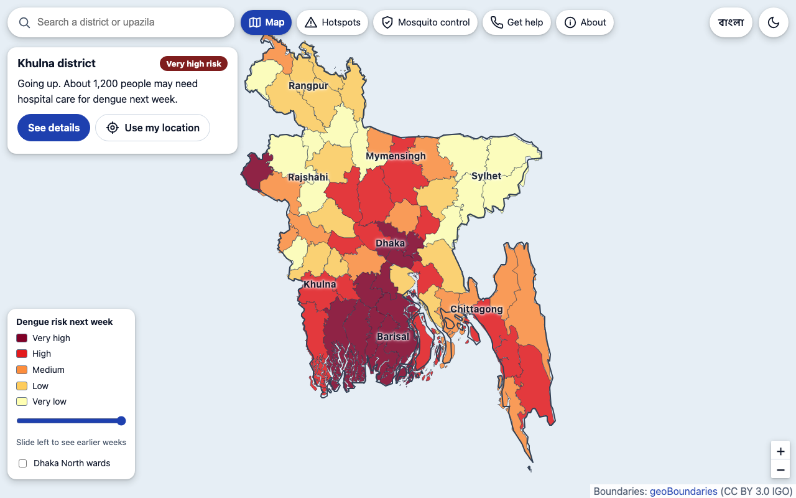
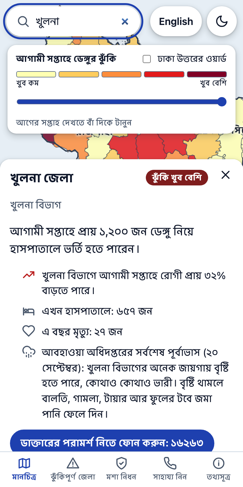
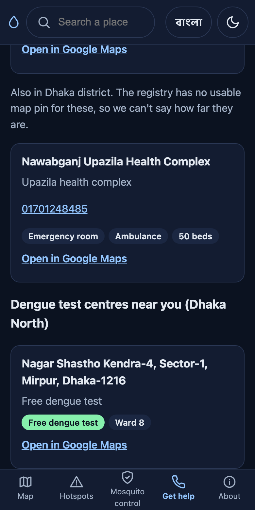

# Dengue Link BD

A dengue map for Bangladesh that anyone can read. It shows how bad dengue is likely to be in each of the 64 districts next week, what is being done about mosquitoes, and where to get help, in Bangla and English.

In Bangladesh the pieces of the dengue picture sit with different organisations. The health directorate counts patients. The Met Department forecasts rain. Dhaka North City Corporation sprays, traps mosquitoes and rates its wards. Each publishes on its own site, in its own format, and none of it lines up. Dengue Link fetches all of it once a day, joins it by place, and puts it on one page.

**Live page: https://dhrupo.github.io/denguelinkbd/**

It needs no extra hardware, no accounts and no paid services. Every source is a public page that opens without a login, a captcha or a key.



| Place panel, in Bangla | Nearest hospitals, dark mode |
|---|---|
|  |  |

## What you can do with it

- **See your own area first.** Tap *Use my location* or search a district or upazila. You get one line ("Khulna: very high risk, going up. About 1,200 people may need hospital care next week, likely between 500 and 2,400") and a few facts: the trend, patients in hospital now, deaths this year, and the Met Department's rain forecast for your district over the coming days. When the forecast has proved itself further out, a small chart shows the next few weeks too, each with its likely range.
- **Read the map at a glance.** Five colours, from very low to very high, based on expected patients per 100,000 people. A slider replays the last 12 weeks on the same scale.
- **Compare with past years.** A chart puts this year's weekly patients beside 2023, 2024 and 2025, and says when dengue usually peaks and whether this week is higher than the same week in past years.
- **Find help.** The nearest government hospitals with phone, emergency room, ambulance and bed count, worked out in your browser. Tap-to-call numbers for a doctor (16263), an ambulance (999) and Dhaka North's dengue control room. In Dhaka North, the nearest dengue test centres, free ones first.
- **Look after someone at home.** Home care and the signs that mean "go to hospital now", put in plain words from the government's own guideline for doctors, with the source named.
- **See what is being done.** Dhaka North's weekly Aedes mosquito counts by zone, its own risk rating for each of its 54 wards, and which days each area is sprayed. Each ward shows its patients in the last 7 days against the week before, per 100,000 people, and what the rating is based on. Search a neighbourhood ("Matikata", "Uttara Sector 4") to open its ward.
- **Check your home.** A six-item checklist that stays on your phone and asks you to look again when rain is forecast.
- **See who is getting sick.** Patients and deaths by age group, and the share who are men.

Light and dark mode, Bangla and English, phone and desktop. The accessibility check (axe) passes on every view in every combination.

## Where the data comes from

| Organisation | What we take | How often |
|---|---|---|
| Health directorate (DGHS), dengue dashboard | Weekly patients in each division; weekly national patients for the last three years; patients and deaths by age and sex; Dhaka North and Dhaka South counted separately | Daily |
| DGHS, daily press release (PDF) | New patients, patients in hospital and deaths for each district | Daily |
| DGHS, health facility registry | Government hospitals: name, map pin, phone, emergency room, ambulance, beds | Weekly |
| DGHS, national dengue guideline (5th edition, 2025) | Home-care advice and danger signs | Fixed text |
| Meteorological Department (BMD) | Today's rain forecast for each division; official heavy-rain warnings | Daily |
| BMD district forecast (BAMIS) | Rain expected in each district over the coming days | Daily |
| Dhaka North City Corporation (DNCC) | Ward spray plans; its own ward risk ratings with daily patients, population and neighbourhood names; area-by-area spray days; dengue test centres; control-room numbers | Daily and weekly |
| Jahangirnagar University with DNCC | Weekly Aedes mosquito trap counts for five zones | Weekly |
| DNCC Innovation Lab | Daily national patient counts since 2022, for the seasonal pattern | Once |
| Open-Meteo | Past rain, temperature and humidity for the forecast model | Daily |
| 2022 census (via HDX) | Population of each district | Fixed |

Several things people would want are simply not published anywhere, so the page does not show them: free beds in each hospital, mosquito-control work outside Dhaka North, official ward-by-ward mosquito surveys, and current dengue test prices.

If a source is down, that part of the page says so and the rest still loads. Nothing old is shown as if it were current.

## How the forecast works

DGHS publishes past dengue figures only by division, so the forecast is made in two steps:

1. **Forecast each division.** A small model is offered eight signals: the division's own recent growth, growth and case load in neighbouring divisions, rain two to three weeks earlier, how dengue usually moves at that time of year (from 2022–2025), the Aedes mosquitoes caught in Dhaka North two and three weeks earlier, and temperature and humidity two weeks earlier. Weights can only be positive, and a signal that does not help is dropped. On the current data it keeps the last four.
2. **Share it between districts** by how many patients each district had in the last two weeks.

Risk levels are the five equal groups of districts ranked by expected patients per 100,000 people.

**A likely range, not just one number.** Every past forecast in the check below is compared with what really happened. The middle 80% of those misses becomes the range shown for each district. Each past week is scored against a range built only from the weeks before it, so the page can say honestly how often the range held: 87 times in 100 for the division forecasts on 7 October 2026. District ranges are less certain than that, because each division's total is shared between its districts, and the page says so.

**Further ahead.** The same model is also fitted to look 2, 3 and 4 weeks ahead. A week further out is shown only while it beats "same as this week" by at least 3% in the check, and never after one that didn't. On 7 October 2026 all three did, by 10%, 22% and 21%.

Two other signals were tried and left out because they made the forecast worse: rain six to ten weeks earlier, and views of the Bangla Wikipedia article on dengue.

The forecast is checked against the past on every build. On 20 September 2026 it was off by about 77 patients per division per week, where simply guessing "next week will be like this week" was off by 90. The page shows these numbers under *About*, and says so plainly if the forecast ever does worse than the simple guess.

Nobody publishes dengue figures for upazilas. Searching an upazila opens its district and says so.

### Early warning from a fly's brain

The part of a fruit fly's brain that learns smells is very good at one thing: noticing that a pattern is new. Using the FlyWire brain map, this project copies the real wiring of that circuit in the fly's right hemisphere (55 input channels feeding 2,421 Kenyon cells, with only the most active 5% allowed to fire). Each week it "smells" the pattern of rises across the eight divisions and scores how new it is, from 0 (seen before this year) to 1 (never seen). A score of 0.5 or more puts a notice on the map. The wiring ships with the project as a 32 KB file, so no brain data has to be downloaded.

## Privacy

- **Your location stays on your device.** The district you are in and the nearest hospital are worked out in your browser. Nothing about you is sent anywhere.
- **Other people's details are never collected.** The hospital registry also publishes staff names, personal numbers and bank details. Only the hospital's own name, pin, phone and services are read. DNCC's sheets name supervisors and contact people with their mobile numbers. Those columns are never even requested. Tests check both.
- No cookies, no analytics, no accounts.

## Run it

You need Python 3.11 or newer and [uv](https://docs.astral.sh/uv/).

```bash
git clone https://github.com/dhrupo/denguelinkbd.git
cd denguelinkbd
uv sync

# Live site at http://127.0.0.1:8000
uv run python -m dengue_link serve

# Or build the page once to out/map.html
uv run python -m dengue_link
```

The first visit of the day shows a progress bar while the sources are fetched, which takes about 20 seconds. After that the page opens at once: the server keeps the build for 24 hours, and so does your browser. No source is allowed to hold the page up for more than 30 seconds.

## How the live page is published

A GitHub Actions job (`.github/workflows/pages.yml`) builds the page once a day at 13:30 Dhaka time, after the Met Department has posted its forecast, and publishes it to GitHub Pages. It also runs on every push to `main`.

- From GitHub's machines the link to Bangladesh's government servers drops out for a few minutes at a time. A build that misses a source is tried again, up to three times, two minutes apart, and the attempt with the fewest gaps is published.
- If DGHS cannot be reached on any attempt, the job fails and the last good page stays online.
- A page that has missed an update says so: once its figures are more than 30 hours old, a notice shows the date they were last updated.
- Each build carries forward the daily reports and mosquito surveys that earlier builds collected, because those drop off their source pages.
- Vercel can serve a copy too. It does not run the app (the app keeps a database and history on disk, which Vercel does not allow). `vercel.json` simply makes each Vercel build download the finished page from GitHub Pages. To keep that copy fresh, create a Deploy Hook in the Vercel project and save its address as the repository secret `VERCEL_DEPLOY_HOOK`; the daily job then calls it after publishing.
- GitHub pauses scheduled jobs in a repository that has had no activity for 60 days. Any push, or pressing *Run workflow*, starts them again.

## Tests

```bash
uv run pytest
```

About 220 tests. They run against saved copies of each source in `tests/fixtures`, so they need no network. Personal details in those copies have been replaced with made-up ones. One DNCC spray-plan PDF is left out of the repository because it lists each worker's name and mobile number; the three tests that need it are skipped until you save a plan from [DNCC's site](https://dncc.gov.bd/pages/mosquito-kill-plans) as `tests/fixtures/dncc_plan_zone4.pdf`.

Browser tests (Playwright, in `e2e/`) open the real page, built from the live sources, on a phone and a desktop screen, in both languages, and run an accessibility check (axe) on every view:

```bash
npm install
npx playwright test
```

## Project layout

```
dengue_link/
  pipeline.py          fetches every source side by side, builds the forecast, renders the page
  forecast.py          the division model, the district split and the check against the past
  flybrain.py          the fly-brain novelty score
  mapview.py           turns the results into the page (all wording, English and Bangla)
  map_template.html    the single page: map, search, panels, styles and script
  server.py            the small web server, the progress page and the 24-hour cache
  dghs_dashboard.py    DGHS dengue dashboard
  dghs_scrape.py, dghs_pdf.py   DGHS daily press-release PDFs
  hospitals.py         DGHS health facility registry
  bmd.py               Met Department forecast and warnings
  bamis.py             Met Department district rain for the coming days
  dncc_plans.py, dncc_sheets.py, ju_dncc.py, dncc_lab.py   Dhaka North sources
  weather.py           Open-Meteo
  areas.py, bangla.py  map outlines, neighbours and Bangla place names
  db.py, fetch.py      the small SQLite store and shared download helpers
data/raw/              map outlines, ward outlines, Bangla names, population
data/pn_kc.npz         the fly-brain wiring
tests/                 tests and saved copies of each source
e2e/                   browser tests against the running page
```

## Credits

- Map outlines: [geoBoundaries](https://www.geoboundaries.org), CC BY 3.0 IGO
- Bangla place names: [nuhil/bangladesh-geocode](https://github.com/nuhil/bangladesh-geocode), MIT
- Dhaka North ward outlines and past daily counts: [DNCC Innovation Lab](https://github.com/dnccinnovationlab/dengue-dashboard)
- District population: Bangladesh Bureau of Statistics, 2022 census, via [HDX](https://data.humdata.org/)
- Fly-brain wiring: the [FlyWire](https://flywire.ai) connectome (v783). The idea of running the fly brain as software comes from [eonsystemspbc/fly-brain](https://github.com/eonsystemspbc/fly-brain).
- Weather history: [Open-Meteo](https://open-meteo.com), CC BY 4.0
- Map drawing: [Leaflet](https://leafletjs.com)
- All dengue, hospital, weather-warning and mosquito-control figures belong to the organisations listed above.

## Please note

These are estimates made from public figures. They are not official DGHS numbers, and the page is not medical advice. If someone is ill, call 16263 or go to a hospital.
